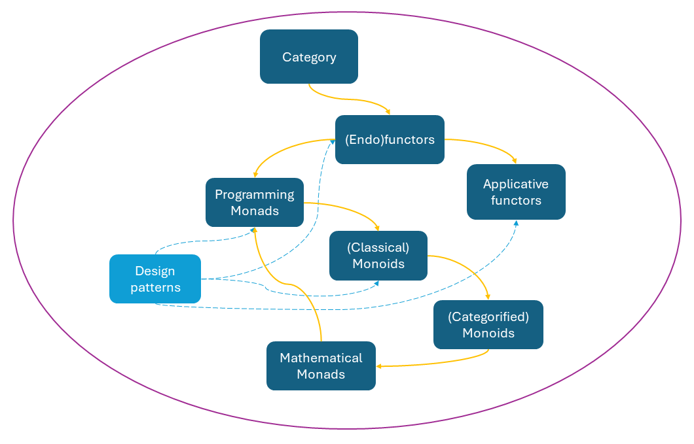
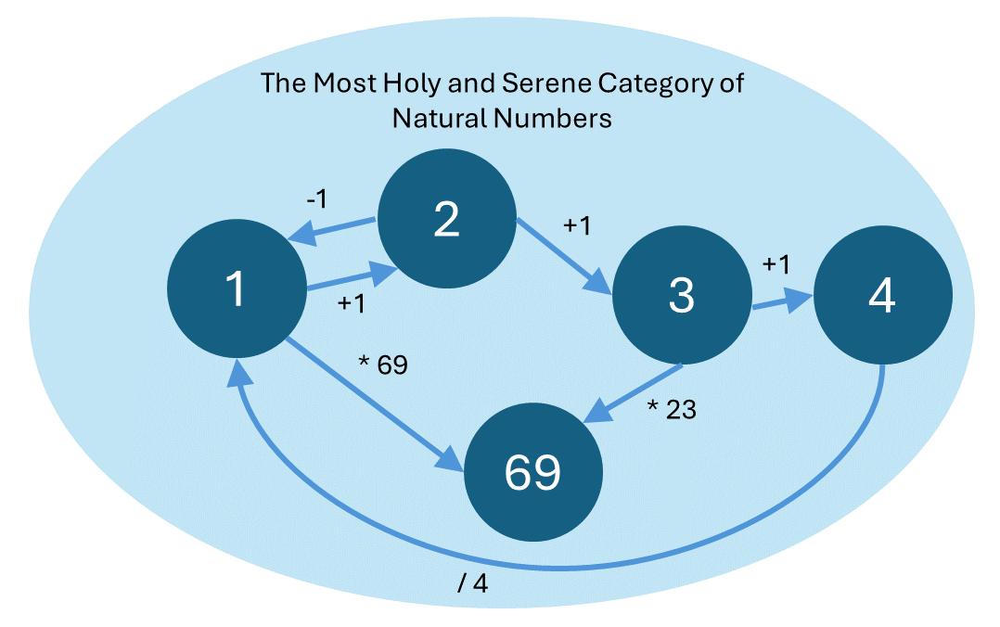
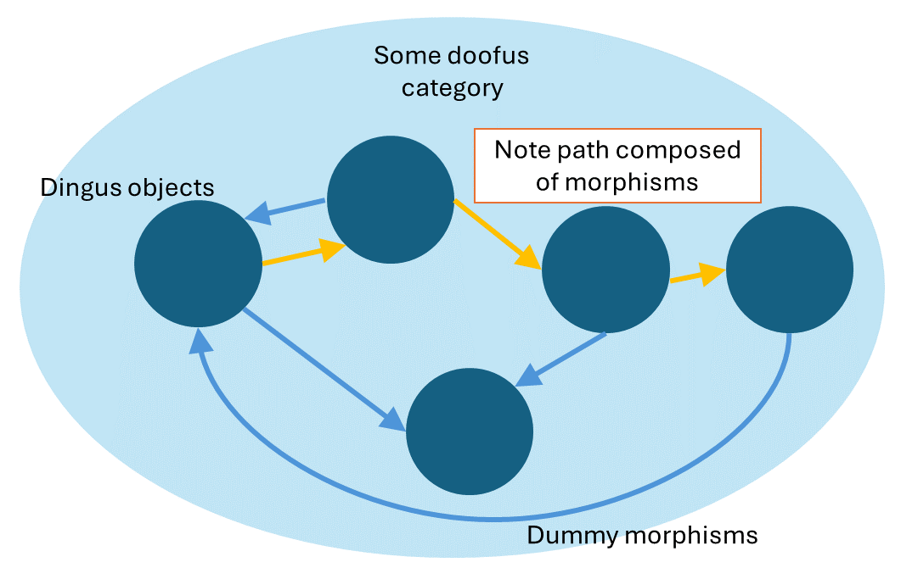
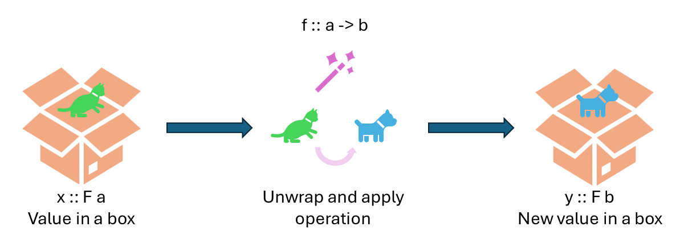
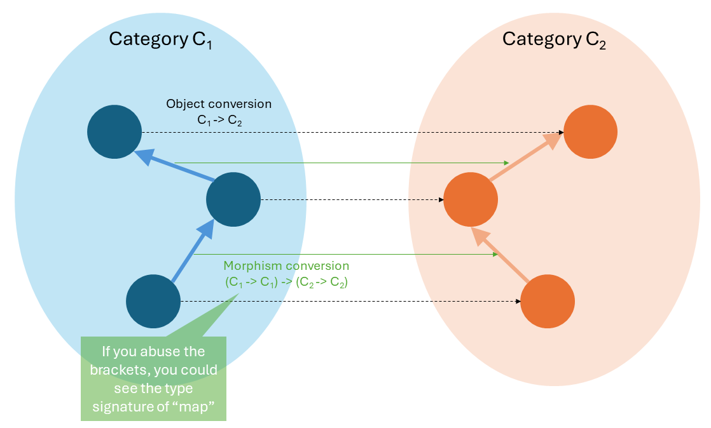
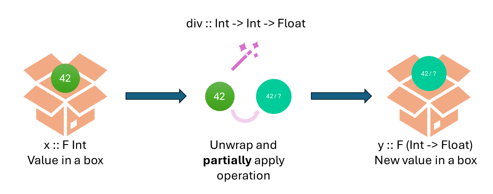
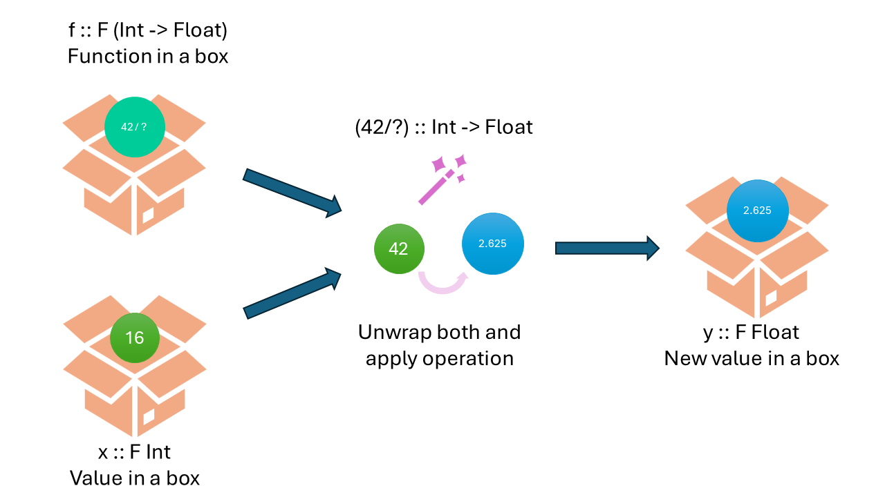

The following is the first part of a series that seeks to motivate the infamous statement **“A monad in category C is a monoid in the monoidal category of endofunctors in C”**. The relevant concepts will be described one by one like this:



The orange lines indicate how we motivate one concept after another, and the blue lines show that the things we can use are actually more like design patterns. Let's see how it works out. (This diagram is, in fact, also a category! This presentation is not an original idea though.)

# Beginning with categories

> “Boring time!”

To quote a certain Australian drumming YouTuber, we must dive into mathematics for some foundation.

A **category** is a two-tuple of a set of **objects** and a set of **morphisms** (pretty much relations; arrows leading from one object to another). For instance, the category of natural numbers have objects `{1, 2, 3…}` and linking between 1 and 2 may be the morphism `+1`. Morphisms need not be functions.

  
_Category of natural numbers as example._
 
An analogy in programming would be, apart from the aforementioned integers, the data type of strings, where each possible string is an object and each possible string-to-string operation (e.g. `concat`) is a morphism.

The good thing about morphisms is that they compose transitively. If we can use morphisms to build a path from object A to object B, and from object B to object C, then we have a path from A to C via B. This is very much like function composition.

  
_A goofy category: note how morphisms compose._

The concept of category may be virtually useless to everyday programmers, but not so the ideas stemming from categories. Let us depart from the mathematics for a while.

# Motivating the functor

> “Haters gonna hate, waiters gonna wait, and functors gonna func.”

From this wise adage we know the prerequisite to understanding functors, especially in practical programming, includes proper understanding of **functions**: higher-order functions and functions as data. They are trivial, when compared to functors themselves:

- Function as data / “first-class citizens”: A function is an object, and can be used as an argument / return value for other functions. C does it (sort of) using function pointers, while this is supported outright in Python.
- Higher-order function: A function that operates on functions, i.e. the processor of function-as-data.

Higher-order functions are most beneficial in abstracting repeated patterns. After all, programming is all about building the right abstractions for right processes that work on the right data – the last part is usually the biggest headache.

The world was a fine place where higher-order functions and functors were not needed, when only simple data types existed. An example is (again) the integer: `1, 2, 3` are valid values, and `+, - , *` are valid operations. They are naturally compatible with each other and the programmer does not need to think much about using them (to define a path from one object to another by composing morphisms).

Enter new concepts: composite data types, abstract data types, algebraic data types, whatever they may be. We shall focus on the array (or list) first: it composes a bunch of loose simple data into one object to manipulate. This introduces the issue that the simple operations no longer apply – how do you define “apply plus, minus, multiply etc. to a list”? It may be ambiguous: elementwise operation (e.g. add 1 to each number in the list)? List-wide operation (e.g. concatenating to lists)?

When it comes to the former case, trying to increment a list of numbers may end up looking like this:

```python
my_list = [1,2,3]
for item in my_list:
    item = item + 1
```

Which you can simplify using syntactic sugar:

```python
my_list = [item + 1 for item in my_list]
```

But this can get out of hand when you have ever more need for elementwise operations and complex actions on the items. Also, despite the list comprehension, the readability of the code may suffer, as one has to set aside some mental capacity for the syntax while trying to comprehend the underlying business logic.

```python
# example: scaling a vector represented as a list
vector = [1, 2, -3]
vector = [item * 4 for item in vector]
# and then transforming it some other way
vector = [item if item > 0 else item * -1 for item in vector]
```
(better example needed)

The boilerplate that is cluttering the code here is obviously the for-loop: other than that, we have just a bunch of business logic. We can pull them apart into respective functions. This also promotes reusability.

```python
def map(operation, array):
    return [operation(item) for item in array]

def scale_by_four(number):
    return number * 4

def abs(number):
    return number if number > 0 else number * -1

vector = [1,2,3]
vector = map(scale_by_four, vector)
vector = map(abs, vector)
```

You may notice that we are passing functions around as arguments, and wrote a `map` function to generalize elementwise operation on a list. Now we can reuse this pattern wherever we go – and accidentally end up with a **functor**. That is, a functor is just a fancy name for this sort of **design pattern**.

# Boring time again
From a programming perspective, **a functor is any data type that has the `map` function** (some call it `fmap`) defined as shown previously – we effectively made the list a functor, though it already is because the programming language has implemented it for us – and it is very nice. As we generalize this idea, we may think of data types beyond lists: tuples, dictionaries, strings (iterables), even custom structs, and anything that happens to wrap a value in a box. “Elementwise” operations here would mean **“operate on the wrapped value as if the box isn’t there”.**

What `map` does is that it opens the box, pulls the value out, performs the operation, and finally puts the result back in the box. This way, it is “**structure-preserving**” in two senses: it respects the fact that there is a surrounding wrapper box and takes care of the boilerplate to unwrap it for now, and most crucially, it respects the rules of the wrapped value – our add, subtract, multiply etc. would not behave differently just cause the value was in a box, the operation is transparently applied to the boxed value.

  
_The `map` function can help you turn a cat in a box into a dog in a box._

This “structure preservation” brings us back to category theory and math (ew!).

Remember categories? A category is a set of objects and a set of morphisms. **A functor, formally, is a structure-preserving mapping from a category to another.** To transform a category you need to know four things, and the functor is thus a four-tuple:

- a source category $C_1$
- a target category $C_2$
- a way to convert objects, $C_1 \to C_2$
- a way to convert morphisms, from $C_1 \to C_1$ to $C_2 \to C_2$

The obviously non-trivial part is the final bit. It is what the `map` function does – it takes a function (morphism) working on the old data type (category) and applies it in the new type’s context. It “promotes” morphisms from one category to another, so that paths between objects in the old category still work in the new one, i.e. structure preserving. To be rigorous, the "identity morphism" (does nothing but loops back to the same object) is also preserved across the map.

  
_Looking under the hood how a functor works._

Another way to view this is: The functor is pretty much almost a portal that brings wrapped values back to where they used to be, so the operations can take place. It’s kinda like the Fourier transform to some extent.

The programming functor satisfies the four-tuple requirement in a hacky way: First of all, we can consider all data types in a programming language to live under a common category (this is hacky and wacky, there are theoretical challenges to this idea), so the source and destination categories can be identical (this makes the functor an **endofunctor**) as long as the functor is parametrized / show genericism. That is, the `map` function shall convert morphisms in some plain type `a` to some functorial wrapper `F b`, in order to qualify as an endofunctor. Then, the object conversion mechanism is satisfied by constructors of the new type. Finally, we manually define the `map` function to complete the picture.

To close this part, here’s a bit of Haskell to show the typed function signature of `map`:

```haskell
map :: (a -> b) -> F a ->  F b
```

Breaking it down:
- Functions are denoted using arrows, and `a -> b` means “take something of type a as input and spit out something of type b”. The rightmost type specified is the return type, all others are inputs.
- `F a` is a way to say “a functor (there may be different functors out there – let’s say it’s “F”) wrapping something of type a”.
All in all, this says “take a functor and a function, and return a functor”. The final functor may wrap a different type, depending on the operation you want to do.

With this, we can understand “endofunctors in category C”. The easy part pretty much ends here; let's have a break and return for the second half.

# Bonus: Applicative Functor

> “Functors gonna func, but only for functions with arity one.”

So far the elementwise operations we specified take one argument only (**arity** is one). This raises the natural question: how about functions with arbitrary arities? The workaround is partial function application, i.e. **currying** (neither of which should be taken for granted in any programming language, you have been warned).

For starters, here is a way to reduce a function of two arguments to a function of one:

```python
def outside(argument1):
    def inside(argument2):
        operate(argument1, argument2)  # this means we do something to the two arguments, which are in scope.
   return inside

outside(x)(y)
```

The last line is juicy: `outside(x)` simply returns a callable function, which we then call with the second argument. From the inner function (returned callable)’s perspective, the first argument has been given in the environment which it remembers. This scoping technique is called **closure**, and breaking down a function into one-arity functions that take other arguments via closure is called “currying”. In Python you can actually do this:

```python
from functools import partial

def operate(argument1, argument2): ...  # some function

fixed = partial(operate, argument1=x)
fixed(argument2=y)
```

The `partial` function does the same thing in a more readable format: it partially applies the function and basically locks down one argument’s value. This way we get a callable back and it will have a smaller arity.

In case of operating on boxed values, we can curry the function first and pass it to `map`. On another hand, to apply a function to two boxed values simultaneously, you may need to “partially map” it to achieve currying, so you can then `map` the rest. But that’s not really how it pans out.

Consider wrapped values `F[x :: a]` and `F[y :: a]`, two functorial boxes containing values `x` and `y` (both of some type `a`, for simplicity) respectively. If we try to map an operation `f` (lowercase f, `f :: a -> a -> b`) over `F[x]`, we should expect something like this:

- The box is opened and we get `x`
- We try to apply it to `f`. Lacking enough arguments, let’s say it is smart enough to partially apply it automatically. This step returns a function `f’ :: a -> b`
- Map will box the result again, ending with a boxed function `F[f’ :: a -> b]`.

  
_One does not simply `map` a function of arity two._

This is not very good – we can’t directly **map a boxed function to another box**. Let us introduce the applicative functor.

The **applicative functor** (in Haskell at least) is any functor that implements two functions:

- `pure :: a -> A a`, where `A a` stands for “an applicative functor wrapping type a”
- `(<*>) :: A (a -> b) -> A a -> A b`

The second function we can call it **“apply”** for now. It takes a boxed function and a boxed value, unwraps both, applies the function, and rightfully puts the result back in a box. The first function `pure` is a minimal constructor for new applicatives.

  
_...And does the rest of the job._

This, once implemented, will allow us to complete the second step – apply the boxed function. You may notice how this lowkey performs currying. All in all, it looks like this:

```python
result = apply(map(f, F[x]), F[y])  # has type F b
```

We can thus say the applicative functor is **another design pattern** that is extracted from common use of applying functions over wrapped data types. It **solves the special case of a wrapped function to be applied**. However, it may not necessarily be as widely useful as the functor.

Finally, a quick proof that the applicative is a functor:

- It converts between valid data types, so we can use the endofunctor trick here to set source and destination categories as “category of all data types”. This is a weak statement, but based on `pure` we sorta know the data types (categories) we actually refer to - usually some parametrized type.
- The `pure` function is an object converter.
- `map` (morphism converter) can be defined from `apply`: (Haskell syntax) `map f x = apply (pure f) x`
  - Using `pure` we convert a plain function (`a -> b`) to a wrapped one, so it can slide into `apply`.

# Takeaways

Foodpanda? Wrong place. Important TLDRs:

- A category is a two-tuple: a set of objects and a set of morphisms (arrows between objects).
- In programming, a functor is a data type that implements the `map` function, which applies another function inside a structure.
- In category theory, a functor is a four-tuple that converts from one category to another, mapping its objects and morphisms while preserving the original structure. The morphism map corresponds to the programming `map`.
- An applicative functor is a data type that implements the `pure` and `apply` functions, so that `apply` can take care of functions inside a structure.
- Programmers may consider the functor and the applicative design patterns of abstractions aiming to reduce boilerplate code.

See you in the [next episode](./monads%20(2nd%20half)%20-%20monads%20and%20monoids.md) lads and lassies
