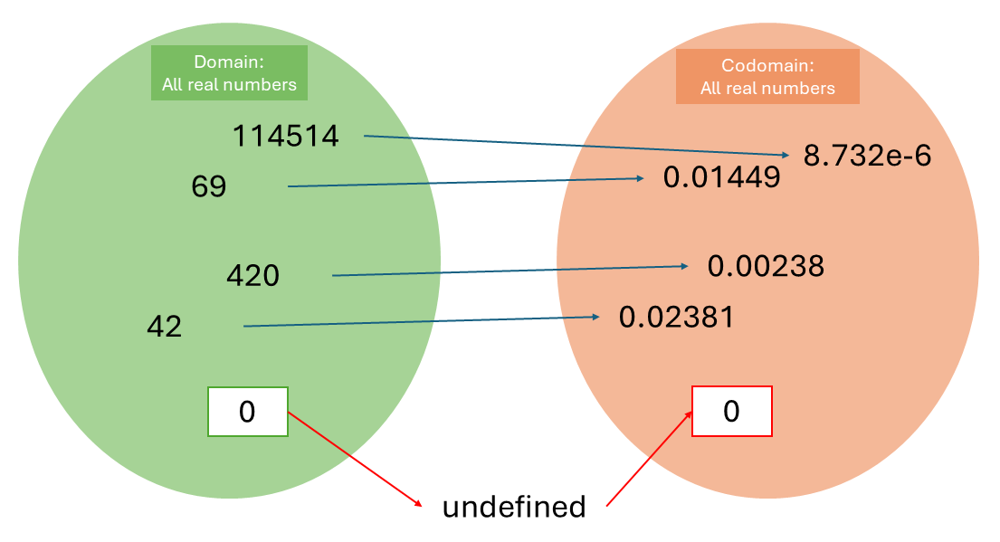
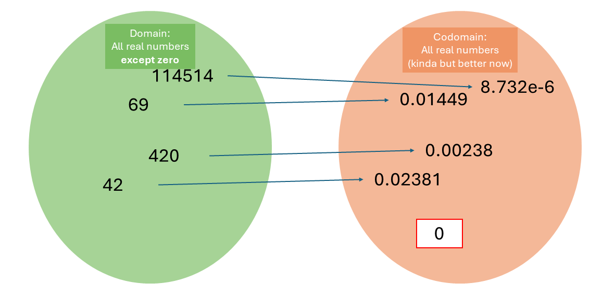
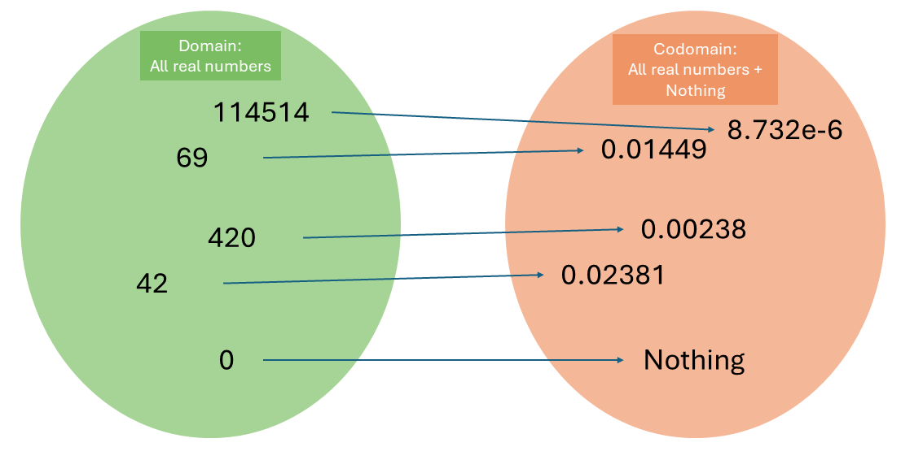
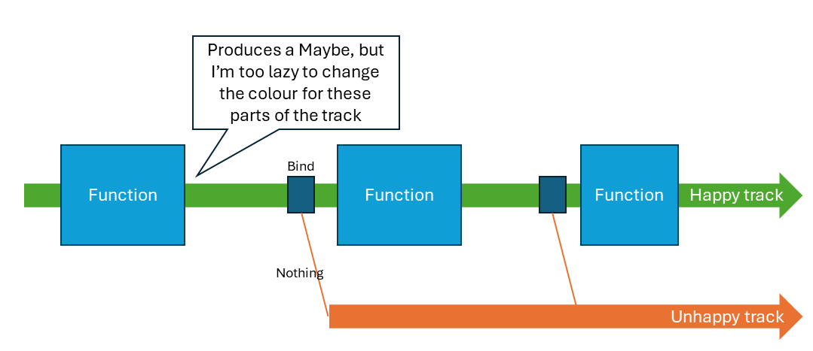
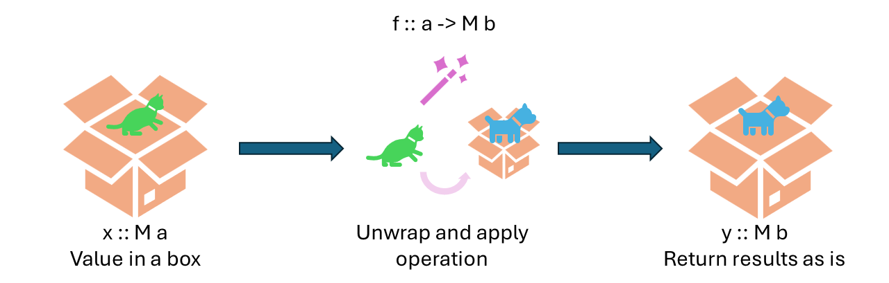
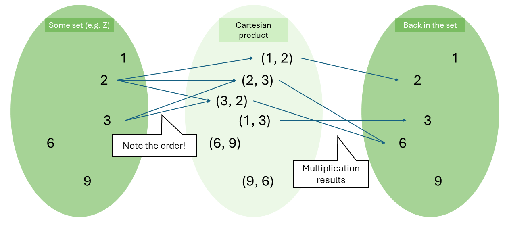
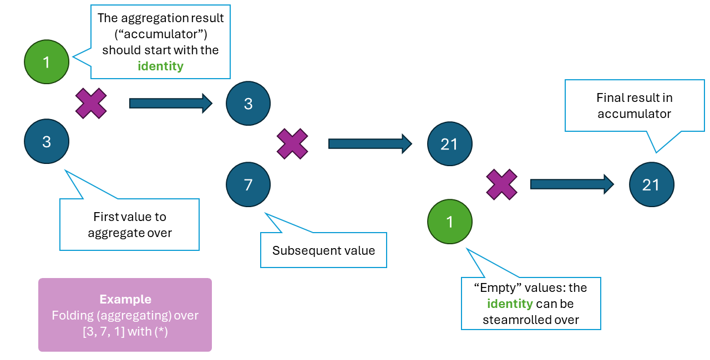
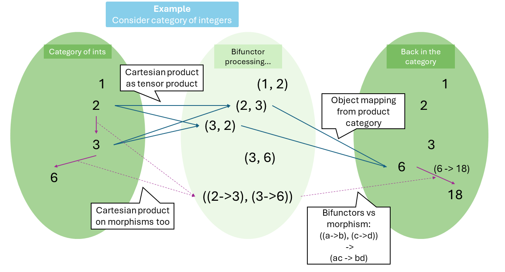
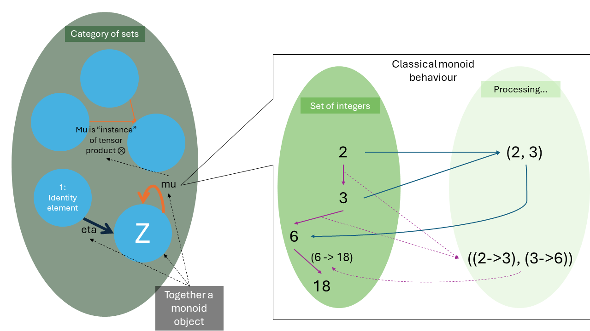

Welcome back. This is the second half of our misadventure towards **“A monad in category C is a monoid in the monoidal category of endofunctors in C”**. [Last time](./monads%20(1st%20half)%20-%20functors%20and%20applicatives.md) we learnt about categories and functors, so at least a few of the concepts are understood. Let us begin by engaging the greatest vermin of functional programming – the **monad** – which has the reputation equivalent to Giant Steps in jazz.

# Motivating the monad

> “Haters gonna hate, waiters gonna wait, functors gonna func, applicatives gonna apply, monads gonna... moan?”

The concept of monad is jazzy but deceivingly simple. In functional programming, all we care about is composing (ideally pure) functions into a quasi-pipeline that turns input into output we so desire. A monad is just a specific construct to help us reduce boilerplate when we compose functions.

The classic example to motivate a monad is error handling. While in languages like Java there are constructs that capture exceptions and interrupt the program flow (`try`-`catch` blocks) at the expense of deeper indentation, the concept we outline below will be similarly usable (when you have had enough of `try`-`catch` or `throw`).

Let’s begin with division. The division operation takes in a real number and spits out another – but there’s a catch. If the divisor is zero, division is not defined. Therefore, the function $f(x) = 1/x : \mathbb{R} \to \mathbb{R}$ is not really a function – it is not bijective, because it is not injective given that $f(x = 0)$ is undefined in the codomain. (Technically, division is not surjective either, because if $f(x) = 0$ you can’t find a corresponding $x$. Let’s focus on the domain for the time being.)

  
_Division as it is._

One solution here is to adjust the input domain: we create a new data type that says “all real numbers except zero”. This sidesteps the problem for now.

  
_Division but we change the domain._

The other solution is similar to how we normally handle this (i.e. always check for zeros): create a new data type for the codomain, saying “all real numbers (except zero, not surjective), and a special value that stands for division by zero”. This *includes* the expected error, which is returned to the caller for handling (a poor man’s `throw` statement).

  
_Division but we change the codomain._
 
Python programmers may find this hauntingly similar to the notion of union type `Float | None`, but this loses the possible verbosity to specifically mark it’s an error instead of a `None`, while adding the usual boilerplate to always check for `None`. In certain programming languages like Haskell, we implement the second solution as an algebraic data type. Introducing the **`Maybe`**:

```haskell
data Maybe a = Nothing | Just a
```

This defines a parametrized data type called “`Maybe`”. It can either be the singleton value called “`Nothing`” (which represents something ugly), or wrap a value of some type `a` using the constructor “`Just a`”. This data type now represents anything that could possibly go wrong and fail to return a usable result.

Now let’s define a dangerous function, e.g. actually doing division with it:

```haskell
-- This is a Haskell function. It matches the pattern of the input line by line, so zero will hit the “Nothing” case.
reciprocal :: Float -> Maybe Float
reciprocal 0 = Nothing
reciprocal x = Just (1 / x)

-- In this function, only one pattern is required, because it can match all real numbers.
square :: Float -> Float
square x = x * x

-- This driver code has a “let-in” expression, which defines local variables under “let” so it can be used in “in”. The “case-of” expression is also a pattern matcher.
work :: Float -> Maybe Float
work x = let temp = x + 69
             inverse = reciprocal temp
         in case inverse of
                Nothing -> Nothing
                Just v -> Just (square v)
```

This is just some dingus dummy code to show what could happen. Right off the bat we have a function that computes reciprocals, and instead of throwing exceptions everywhere, it returns a `Maybe` to represent possible failures. As a result, in the subsequent worker code, after it receives the result from `reciprocal`, it needs to check whether it’s a `Nothing`, in which case computation stops. This is fine and all, but what if we need to chain another computation behind this?

```haskell
-- another stupid function
invert :: Float -> Float
invert 0 = 0
invert x = x * -1
 
-- driver code. The second case-of can be inside the let block but you get the idea
work :: Float -> Maybe Float
work x = let temp = x + 69
             inverse = reciprocal temp
             squared = case inverse of
                            Nothing -> Nothing
                            Just v -> Just (square v)
         in case squared of
                 Nothing -> Nothing
                 Just s -> Just (invert s)
```

Notice that we need to handle the unhappy path `Nothing` every time, and this adds much cognitive clutter to the code. Let’s separate this into its own function – just like how we created `map`.

```haskell
bind :: Maybe a -> (a -> Maybe b) ->  Maybe b
bind m f = case m of
                Nothing -> Nothing
                Just x -> f x
```

Breaking it down:

- Once a `Maybe` is introduced, it becomes necessary to pass it forward (so the error is correctly delivered to the end), so the function we write must accept and return a `Maybe`.
- It takes a function that returns a `Maybe`. This is to permit flexibility, in case any operation down the line is just as risky. It doesn’t need to take in a `Maybe` – this is the annoyance that we will take care of.
- The `Nothing`-check is moved in here.

Now we rewrite the driver code:

```haskell
-- Note: the period (.) is a symbol for function composition.
work :: Float -> Maybe Float
work x = let inverse = reciprocal (x + 69)
             squared = bind (Just . square) inverse
         in bind (Just . invert) squared
```

Note how this is almost like function composition (e.g. `invert . square . reciprocal`); this will have *huge* implications – just like functors, monads essentially provide a way to compose functions. Aside the small issue that we need to wrap our `square` and `invert` functions with `Just` to convert their output to a `Maybe`, we have cleaned up the code, and got a **monad** in the meantime. Yes, monad is just this kind of stupid tomfoolery design pattern.

# Finally (?), introducing the monads

In programming, **a monad is a data type that implements the `bind` function** (in Haskell also an infix operator `>>=`, e.g. `squared >>= (Just . invert)`. Nomenclature may vary) **and the `return` function** (which is a minimal constructor, like `pure` in applicative functors). **Monads are used to wrap up context for easier management**; the context can be error handling, IO, mutable states, etc.

With the `bind` function serving as the glue, we can now attempt **railway-oriented programming**, i.e. using `Maybe` or its more verbose friend `Either` (unhappy path now wraps a piece of data to clearly represent the exception) to keep the happy path separate and easy to focus on. However many possibly failing functions we chain together in a pipeline, we can execute them just fine: any errors (`Nothing`) will be picked up by `bind` and automatically set to bypass subsequent processing. All we need to care about is the bunch of `Maybe`-producing functions.

  
_A poor illustration of railway-oriented programming._

Thus (I hope) you can see how monads are about composing functions and keeping the boilerplate contained. Before we move on to monoids (cough), let’s quickly look at the definitions of a monad in Haskell type signatures:

- `return :: a -> M a`
  - This one wraps a piece of data inside a context (“box”); the barebones constructor of a monad, so to speak.
- `(>>=) :: M a -> (a -> M b) -> M b`
  - The `bind` function takes a monad (boxed value), unboxes it, applies the given function, and returns the result as it is.

  
_The monadic bind in the simplest nutshell I can find._

The two corollaries one may observe include: Firstly, the description of `bind` (without thinking about its implementation) looks like an extension of a functor. The difference here is that we obtain a box from the operation to perform, so we don’t need to wrap it up again – arguably, `bind` solves a special case of `map`, where the function to map already returns a box. We will see that **the monad is just the functor with extra steps**. Secondly, this also looks eerily similar to the applicative functor. The `return` function is an exact analogue of `pure`, and we can show that the monad is also an applicative (we’ll get to that, we need more vocabulary).

# Switching our attention to monoids

> “Monads gonna moan, monoids… probably gonna moan as well. They’re very closely related, we’ll see.”

The notion of monoids is just a mathematical concept that you can use to describe very mundane things related to binary operations. To get started, get an ounce of **semigroups**.

In abstract algebra, **a semigroup is a set with an associative binary operation that works with the set members**. In arithmetic, we can consider the set of integers and the operation multiplication (binary – you do $x$ times $y$; associative – $(x \times y) \times z = x \times (y \times z)$ in all situations) a semigroup; addition also satisfies the criteria. Let’s add more ingredients.

In the classical (algebraic) sense, **a monoid is a semigroup plus an identity element** (for the binary operation). This additional criterion means the binary operation has some sort of fixed point; there is a concept of zero. For instance, the identity element for multiplication is one, cause anything times one is the same thing, whereas zero is the identity for addition. Formally, there exists an $e$ such that for all $a$, $operate(e, a) = operate(a, e) = a$ ($a$ is the left- and right-identity of the operation). Alternatively, **a classical monoid is a three-tuple with a set, an identity, and an associative binary operation.**

Diving deeper into the concept of binary operations, we can define them as “maps from the Cartesian product”. From our set $S$, we find all possible pairs between set members as the Cartesian product $S \times S$, then we map each pair to a desired value in the same $S$. This way, integer multiplication involves generating the pairs like $(1, 2)$ and $(2, 3)$, and then mapping them to the integers $2$ and $6$ respectively. The role of the binary operation is that it chooses where to go from each pair. As a analogy, mathematicians may call the binary operation “multiplication” and the identity “unit”.

  
_Mental gymnastics: consider multiplication in terms of Cartesian products._

You often see monoids in programming once you start looking. Apart from handling numerals, strings are monoids with concatenation (empty string as identity), and as a corollary lists are monoids with the same criteria. In programming, we can turn our two-argument functions into a monoid by ensuring:

1. The two parameters and the output are of the same type (of course), to define the monoid’s set to our data type.
2. There is an identity element for the function. Whether it is the first or the second argument shouldn’t matter.
3. Associativity is respected.

The single most powerful (but apparently trivial) aspect of monoids is they **allow homogenously aggregating or accumulating** over the data type / data structure. Examples include:

- Summing over a list of numerals: numbers, summation and zero form a monoid.
- Joining characters or strings into one, or set unions: same as above.
- Comparisons and orderings: combining the results sees “equal” being an identity.
- Certain trees: tree elements, some other monoid that works over the elements, and a specifically designed “empty node”.

  
_Aggregation over a list is convenient if you have a monoid._

So the monoid is a mathematical construct to help drive such “foldable” designs; Haskell creates a specific typeclass for generalizing them.

A `Maybe` monad satisfies the requirements of a monoid when the value it wraps is a monoid. Then, the `Maybe` monoid uses `Nothing` as the identity element, and any aggregating binary operation will bypass the `Nothing` and aggregate the values wrapped in the `Just` parts. As long as the aggregating operation is associative, we can “promote” this capability (monoidal structure) to the `Maybe` monad. Does this generalize to all monads? Pretty much yes, we’ll see it soon.

# Monoids, but in category theory

> “Monads gonna moan, but not without moan-oids first.”

This is where it all gets horribly sophisticated. Category theorists like to do this thing called “categorification”, which means describing mathematical concepts (oftentimes from set theory) in the language of their theory. The categorification of monoids introduces two ideas called “monoidal category” and “monoid \[object\] in a monoidal category”. Let’s get to them one by one.

Remember categories are a set of stuff (objects) and a set of arrows pointing between the stuff (morphisms)? We can assume the objects form the set and find a suitable binary operation to establish something like a monoid in the category. This is sadly not trivial.

The **binary operation is a “tensor product”**, as a generalization of the (classical) Cartesian product though we can still consider it that way, and a bifunctor. Functors are mappings between categories, so a bifunctor maps from two categories to a third one. It scrambles pairs twice:

- Pairs of objects in both categories are computed. For simplicity, we can consider a bifunctor $\mathbb{Z} \times \mathbb{Z} -> \mathbb{Z}$ (let’s say $\mathbb{Z}$ is the category of integers). It generates, as objects, all possible pairs of integers, e.g. $(1, 2)$ and $(9, 6)$.
- Pairs of morphisms are also computed. In our example, we can find things like $((1 \to 2), (3 \to 4))$ and $((14 \to 8), (-3 \to 3))$.
- With our object pairs and morphism pairs, we technically have another category – the product category – as the domain of the bifunctor.
- Depending on what bifunctor this is, we choose how to map from object pairs (or morphism pairs) to their respective destinations. Our example bifunctor can, specifically, choose to do multiplication, so object pair $(1, 2)$ goes to $2$, and $(9, 6)$ goes to $54$.
- Morphisms under the bifunctor are similar; for $((1 \to 2), (3 \to 4))$ we first figure out where the origins and destinations are (namely, $(1,3) \to 3$, $(2,4) \to 8$), next we conclude the right morphism is $(3 \to 8)$. This ensures we preserve the structure.

  
_Understanding bifunctors, the illustration._

**A monoidal category $C$ has a bifunctor (“tensor product”, denoted $\otimes$) $C \times C \to C$**, so that it corresponds to how classical monoids forms a closure in the set. **$C$ also has an object that is the unit (left and right identity, denoted $\textbf{1}$ or $\textbf{I}$) of the tensor product**. Hence the monoidal category is a three-tuple with $C$, $\otimes$, and unit. To ensure that the bifunctor respects identity and associativity laws (the monoid laws we saw), isomorphisms and diagrams to commute are introduced as law enforcement, but we won’t get into those.

This does not finish the definition of monoids in category theory. In category theory, they like to recursively define a higher-order concept to wrap something underneath (“vertical categorification” if you like jargon), which may be more specific. Individual monoids (“monoidal objects in a monoidal category”) that correspond to the classical ones are represented as objects in the category. **Not all objects in a monoidal category are necessarily a monoid**, however.

Continuing the integer multiplication example, we note that the set of integers is an object in the set of sets – i.e. an object in the *category* of all sets. This category is, in turn, a monoidal category, where the tensor product $\otimes$ is our usual Cartesian product. This object (set of integers) happens to be a monoid, i.e. an *instance* of this monoid:

- The **monoid object** is $\mathbb{Z}$, the set of integers, who is an object in the \[monoidal\] category of sets. $\mathbb{Z}$ is, in fewer words, a “monoid in the category of sets”.
- $\mathbb{Z}$ is equipped with a “multiplication” morphism (denoted with Greek letter mu, $\mu$), which uses the category’s tensor product as $\mu : \mathbb{Z} \otimes \mathbb{Z} \to \mathbb{Z}$.
  - That is, $\mu$ calculates the Cartesian product – all integer pairs. Taking advantage of the ambiguity what to do next with the product, we say $\mu$ maps the pairs to the (integer) product, e.g. $(3, 23) \to 69$.
  - The result is, of course, inside the same set (the morphism points back to the same object).
  - The transformation of morphisms on $\mathbb{Z}$ (not elements of $\mathbb{Z}$) occurs just as described above.
- $\mathbb{Z}$ also has a “unit” morphism (denoted with eta, $\eta$), which converts the public unit element $\textbf{I}$ to $\mathbb{Z}$.
  - With this, we can enforce the monoid laws.

One may notice that the monoidal category of sets contains all classical monoids.

  
_Monoid, in category theory terms. Do you rather wish to learn Turing tarpits?_

Thus, to conclude, **a monoid in category $C$ refers to a monoid object $M$ in the monoidal category $C$, with two morphisms $\mu : M \otimes M \to M$ and $\eta : \textbf{I} \to M$**. The morphisms refer to and enforce the monoidal structure of the monoidal category. The monoid is thus a three-tuple as well: $M$, $\mu$, and $\eta$.

# Soldiering on to home in monads: Takeaways

> “Monad as a monoid in the category of endofunctors? I’m moaning!”

Time is running out in this mathematical quagmire and we need a winning move to avoid suffocation. Luckily for us, the necessary vocabulary has been acquired. **Any monad in $C$ corresponds to a monoid object in the monoidal category containing all endofunctors of category $C$.** Therefore, monads satisfy the constraints of the monoid. Ok, that’s still a lot to take in, and we still need to relate this back to programming and the concepts we know before – oh, three whistles, the second half is over. We will need extra time.

Let’s head back to the dressing room. Before we [add extra time](./monads%20(extra%20time)%20-%20monads%20step%20by%20step.md), see you, space cowboy, you’re gonna carry that mathematical weight.

Takeaways of this episode:

- In programming, a monad is a data type that implements the return function and the bind function. The bind function applies a function inside a structure, but the function produces some contextual effect (returns a structure).
- The monad is a design pattern that handles such contexts and effects using a special abstraction.
- In set theory, a monoid is a three-tuple: a set, an associative binary operation, and an identity element for the operation in the set.
- In programming, a data structure with monoid properties make for logical ways to aggregate over it.
- In category theory, a monoidal category has a monoid-like structure (namely, a tensor product bifunctor $\otimes$ and a unit object $\textbf{I}$), and contains actual instances of monoids as monoid objects.
- Monoid objects are objects in a monoidal category that reflect the monoidal structure by having a $\mu$ morphism (using the tensor product $\otimes$) and an $\eta$ morphism (using the unit object $\textbf{I}$); they represent the set theory monoids.
 