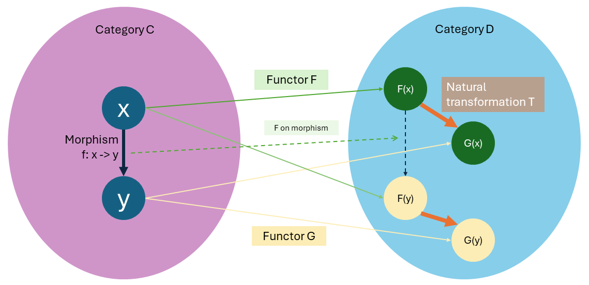
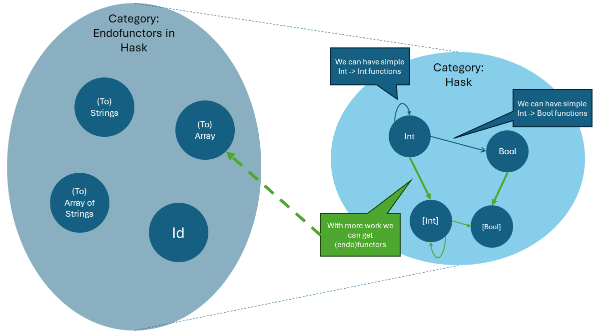
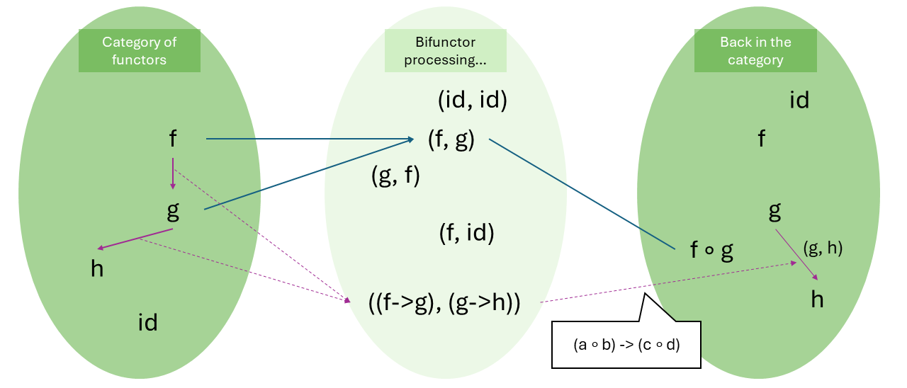
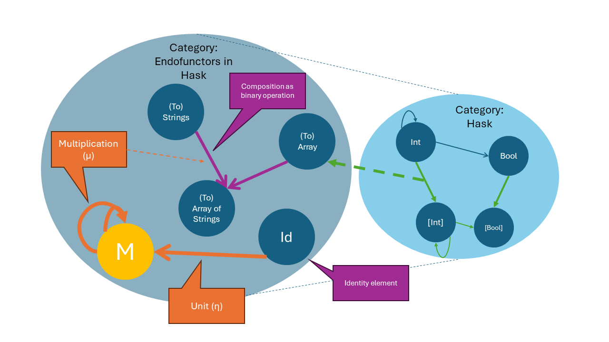
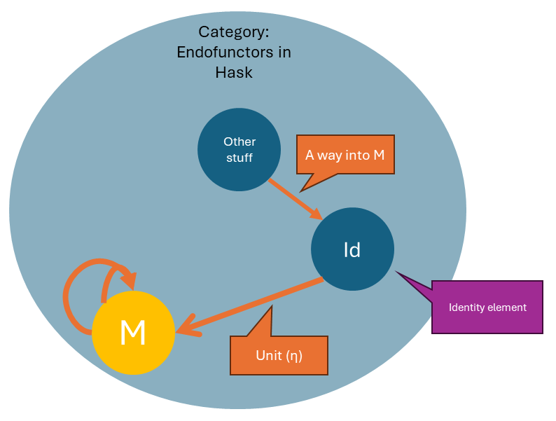
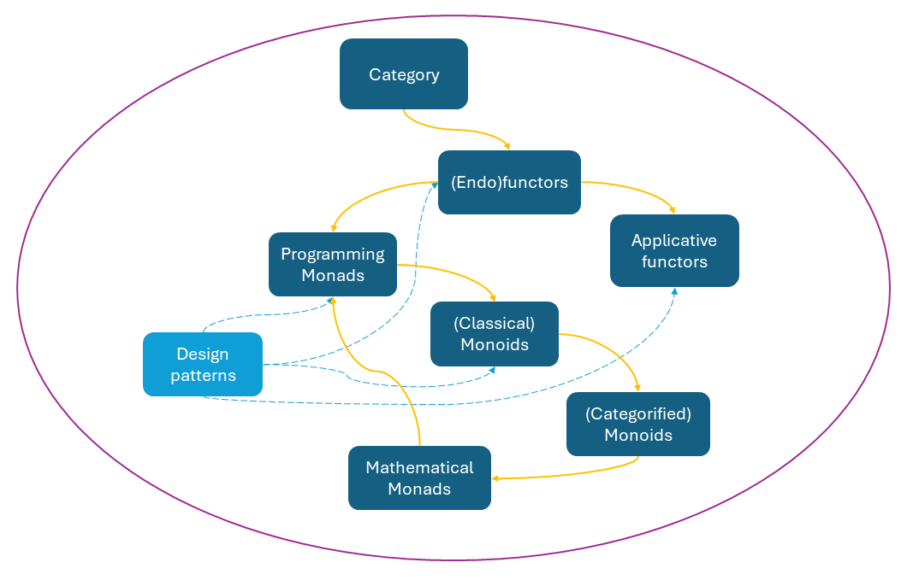

[Last episode](./monads%20(2nd%20half)%20-%20monads%20and%20monoids.md) saw both halves of our monad mishap end in a draw: Having understood categories, functors, (programming) monads, monoids in both classical and category theory senses, we have the necessary vocabulary to comprehend **“A monad in category $C$ is a monoid in the monoidal category of endofunctors in $C$”**, but this longwinded sentence still lacks substance. Let us return to the pitch and add extra time, so as to hopefully understand it in context and link it back to programming. Below will present my chain of thought as I parsed the sentence.

# Working towards the monad, step by step again
> “It’s boring – so boring. Boring!”

## In category $C$
First of all, we must figure out the “category $C$”. In all seriousness this can be any category, but for programming we prefer to consider **the category of all data types**, which we can call "`Hask`" (as it is in Haskell). On HaskellWiki you can read more about the potential pitfalls of this argument, but it works well enough for us – we can conveniently consider a monad wrapping a certain type to be an instance of our general monad notion; this ensures we are only going to deal with endofunctors. All functions we ever write are morphisms in Hask: functions of type `a -> a` are a loop back to the same object (data type), while others point to other types (`a -> b`). From here on out, we use the terms “functors” and “endofunctors” interchangeably unless otherwise specified.

## Category of endofunctors (in $C$)
This brings us to the second point: category of endofunctors. We know functors refer to mappings between categories, and in programming all functors are endofunctors in Hask. The source and destination categories are the same, we only map objects within Hask (i.e. the parametrized data types), and we specify how to map operations (functions) within Hask so they work between new types. A simple way to wrap your head around this is to think of arrays: they map plain types into arrays of those types, and promote operations on simple data types to this compound type. 

With that in mind, we put all such endofunctors into one category. It should also come as no surprise that there is an identity functor, which represents nothing being done. **The morphisms are called “natural transformations” (they convert between *functors*)**. They concern objects that functors operate on:

-	Imagine functors $F$ and $G$, which both convert categories $C \to D$.
-	Imagine an object $x$ in $C$. $F(x)$ and $G(x)$ are, of course, in $D$.
    - The natural transformation $T$ has the effect of $F(x) \to G(x)$, i.e. redirecting the output of $F$ to the output of $G$.
    - $T$ acting on $x$ is such a morphism $T_x : F(x) \to G(x)$ in $D$; it’s called a “component of $T$ at $x$”.
-	A morphism $f : x \to y$ in $C$ is mapped to new morphism $F(f)$ and $G(f)$ respectively in $D$.
    - $T$ does not affect $f$, but with $T$ you have a way to go from $x$ to $G(y)$: $T_y \circ F (f) \circ F(x)$
        - $x \to F(x)$, then $F(f)$ takes you to $F(y)$, then $T$ lands you in $G(y)$.

  
*Natural transformation: note the path from $x$ to $G(y)$ is $F(x) \to$ via $F(f) \to$ via $T$*

Our mental image now should be like this:

  
*Hask and the category of (endo)functors in Hask*

## Monoidal category of endofunctors (in $C$)
The third part is to ensure the category of endofunctors in Hask is a monoidal category. Crucially, we need to find an associative binary operation with an identity element. The smart ones among you will notice how functors can compose, in the exact same way as functions and relations – that’s right, **endofunctor composition is the binary operation** we’re after! Let say our tensor product $\otimes$ is endofunctor composition $\circ$ , such that:

-	Endofunctor composition is a bifunctor $\circ : End_C \times End_C \to End_C$ (where $End_C$ means “the category of endofunctors in $C$”)
-	We find all possible functor-functor pair, e.g. $(f, g)$, and map it to the composition $(f \circ g)$. The composition can, in effect, be treated as a single functor on its own, thus landing us back in the category $End_C$.
-	There can be morphisms (natural transformations) between endofunctors, e.g. $(f \to g)$, which can be some higher-order functions that convert between compound data types.
-	Recall how bifunctors act on morphisms: $((a \to b), (c \to d)) \to (f(a, c) \to f(b, d))$ for some bifunctor $f$. So natural transformations are mapped $((a \to b), (c \to d)) \to ((a \circ c) \to (b \circ d))$.
-	Don’t forget this is associative – fundamentally, this follows from the fact relations compose associatively. (Proof on [StackExchange](https://math.stackexchange.com/questions/3389430/prove-that-the-composition-of-relations-is-associative))
-	Last but not least we need an identity object – we have the identity endofunctor. It does nothing, and is left- and right-identity.

  
*Not the best visualization: functor composition as a bifunctor*

While we know $End_C$ (or $End_{Hask}$) is a monoidal category, the curious may wonder why it has to be endofunctors and nothing else. The reason is straightforward: if our functors keep hopping from category to category, we may not be able to maintain a proper identity for our tensor product.

## Renaming monoids in the category of endofunctors to monads
The fourth and final step is to present a monoid object (“monoid” for short) in this category. In particular, **monoids in the category of endofunctors are always given the special name of “monad”**, because they are a pervasive concept in category theory. 

So, finally, **the formal definition of the monad: As a monoid object $M$, a monad is a three-tuple with endofunctor $M$, “multiplication” natural transformation mu $\mu$, and “unit” natural transformation eta $\eta$. Specifically, $\mu : M \circ M \to M$, and $\eta : Id_C \to M$, where $Id_C$ stands for the identity functor in category $C$.** $\mu$ is defined using the composition operation. As morphisms on functors, they are rightfully called natural transformations.

  
*This should be our mental image now.*

The $M$ part is understandable – it is an endofunctor, because it sits in a category of endofunctors; and for programmers `M` stands for a specific monadic data type, such as `Maybe`. The proof that monads are functors will come later; but the two natural transformations are harder to grasp and will require their own in-depth explanation. 

## The multiplication natural transformation ($\mu$)
There are four ways to understand the $\mu$, which is supposed to correspond to our monadic `bind` function (also called other names like “`join`”, “`flatMap`”, etc.) somehow. This observation raises the fact that **programming monads are at best an idea inspired by mathematical monads**, and thus do not correspond to them hundred-percent. 

As an aside, the construct the programming monad is closest to is actually called a “Kleisli category”, a.k.a. “Kleisli triple”, “extension system” etc., it cares about transitions of `(a -> M b) -> (M a -> M b)`. The Kleisli definition is equal to what we’ve done above. We won’t go into the details but we can consider the bind function to bring together `M a` and `(a -> M b)` in the Kleisli style (converts the latter to `M a -> M b`), so they are composable in the trivial sense.

1.	The “join” or “flatten” solution  
The $M \circ M \to M$ expression means, if we have a doubly-wrapped monad like `M[M[a]]`, we remove one layer of wrapping and return `M[a]`. This defines the "`join`" function with type `M (M a) -> M a`. By far the most common interpretation, it is very useful (can be used to define the usual `bind` we know), but is thoroughly useless in explaining the μ – we compose two M’s, rather than wrapping them. Notably, it is commonly understood that the composition of monads does not yield a monad, though we are concerned about the composition of the *effects* of two monadic endofunctors. 

2.	The “bind’s type signature” solution  
This is a brute-force way to do it. The type signature of `bind` is `M a -> (a -> M b) -> M b`, i.e. take in a monad and a function, then spit out another monad. This fits the nominal description of $\mu$ except the function we take in – it returns a monad, yes, but it is not a monad per se. Or *is it*? We can actually show functions are monads. Even if functions are a different kind of monad (not the `M` type), we can further abuse this by pointing out all data types can be reduced to functions (via Church encoding). So all in all `bind`  just takes in two functions and spits out a third, and given functions are monads, we have the explanation for $\mu$. Obviously, this is not the soundest argument out there.

3.	The “wait a sec this is an applicative” solution  
The expression $M \circ M \to M$ can be reinterpreted as `M a -> M (a -> b) -> M b`, which is the very essence of applicative functors as the `apply` function. This suggests that the monad is just an applicative functor with extra steps – which it indeed is – but does not capture the notion of monadic binds precisely. However, the idea that we are composing data and computations in an effect-aware context is largely captured.

4.	The “look to the tensor product” solution  
Let us use the analogy of mathematical multiplication. What this $\mu$ operation does can be: First compute all possible pairs of instances of the monadic type $M$, then select the one that corresponds to the composite of the instances, and because the composed result is still an instance of $M$, we conclude that $\mu : M \circ M \to M$, or we can (sort of) have $M$ closed under $\mu$-multiplication. This thought is nice as it plays into the monoidal category’s tensor product, and if we permit the ambiguity of the (endo)functor being a data or a computation (moving objects around), then we can say our usual monadic `bind` is an idealized implementation of this idea either by (1) the Kleisli approach, (2) extending the behaviour of functors, or (3) extending the behaviour of applicative functors.

Altogether, I consider there are no perfect explanation of the $\mu$ yet, and the fourth solution is the closest we can reasonably get.

## The unit natural transformation ($\eta$)
This one is much more comprehensible: It should correspond to our monadic `return` function, a.k.a. “`unit`” or “`pure`”. However, $\eta$ does not directly accept a random object and turn it into the monad we want, but it takes the identity functor $Id_C$ instead. There are two ways to view this.

1.	The “a mere placeholder to fit monoid laws” view  
As a monoid, the monad inherits its laws, namely associativity and left-right identity. By providing a direct analogue of the usual monoid $\eta$ we have a way to satisfy them. This view is of course insufficient.

2.	The “a portal to enter the monadic context” view  
Remember how $\eta$ is a natural transformation? We can apply it to any object $x$ in the underlying category $C$ (or Hask) and see what happens: $\eta(x) = (Id_C \to M)(x) = Id_C(x) \to M(x) = M(x)$. The step of applying the $\eta$ to $x$ is a component of $\eta$ at $x$, and by definition we convert it to $M(x)$. This provides a **basic wrapping capability** and introduces any simple stuff into our wonky world of monads. Therefore, the behaviour of `return` function (type `a -> M a`) is successfully justified.

  
*Unit as a portal to monad*

## Monad laws
The mathematical monad laws are given as “coherence conditions”, which under the hood say nothing other than **associativity and identity**.

The HaskellWiki provides a succinct presentation of the programming version of the laws, which we take for granted subconsciously when we use monads. Thus it is important to remain cautious when we write our own monads – we want to obey the monad laws.

```haskell
-- identity: return function should be left and right identity of bind (>>=)
-- left identity, x :: a, h :: a -> M b
return x >>= h == h x
-- right identity, m :: M a
m >>= return == m

-- associativity: not very obvious because of how bind has to work
-- you can’t directly g >>= h as the input to bind must be a monad to the left
-- you can’t directly >>= (g >>= h) either because bind expects a function as input to the right
-- workaround: anonymous function, syntax: \input -> [body expression]
(m >>= g) >>= h == m >>= (\x -> g x >>= h)
```

# More mental gymnastics as addenda! 
> “Wait, I thought we’re done!”

There have been two elephants in the room that we still need to address: how monads are functors and applicative functors.

## Proof: Monads are functors
Monads are, as shown in the formal definition above, (endo)functors in the first place mathematically. Programmatically, we can treat monad as a subtype of functor.

The only non-trivial thing to consider is how to achieve the effect of `bind` with `map`. In fact, we only need to introduce `join` (`join :: M (M a) -> M a`) to achieve the effect:
-	`bind m f = join . map f m`
-	Given a function of type `a -> M b`, we naively map it over the monad `m :: M a`, which yields a result of type `M (M b)`. We unwrap one layer of wrapping to get the desired result.
-	Obviously, this does not care about any checking necessary to do an actually useful bind.

It is less trivial how to achieve `map` in terms of `bind` (and other monadic primitives).
-	`map f m = bind m (\v -> return . f v)`
-	`bind` first unwraps the box `m` to get a value, which it then applies to the subsequent function, defined as an anonymous function.
-	The anonymous function is specifically made so that after the function `f` is applied to value `v` (returning a value of type `b`), we wrap it up in the suitable box again.
-	This way we can achieve the type signature of `map`.

## Proof: Monads are applicative functors
Using similar principles as in the previous section, we can show monads are applicative functors, with a specially-crafted `apply` and `return == pure`.

Let us first construct `bind` in terms of `apply`. The solution looks like this:
-	`bind m f = join . apply (return f) m`
-	We first wrap our given function, then pass it to `apply`. This gives us a `M (M b)` in return, which we then unwrap to get the result needed.

The opposite – to define `apply` in terms of `bind` – is a bit more nuanced.
-	`apply f m = bind f (\g -> map g m)`
-	Notice how we put the wrapped function `f :: M (a -> b)` into the first argument of `bind`, so that it can be unwrapped into a plain function `a -> b`.
-	The next step is to apply this function to the other argument `m :: M a` to get the result (of type `M b`). This is tricky: we want to do this by `map func m` but the `func` variable needs to be supplied somehow.
-	The solution is to construct a makeshift anonymous function. It takes some function `g` and maps it to `m`. The magic is when this is given to `bind`, `bind` supplies the unwrapped plain function into `g`.

# Takeaways
The game to conquer monads has been won, but there is a crowd outside wanting to see a [penalty shootout](./monads%20(penalties).md) anyway. The practicality of certain monads (especially those present in Haskell parlance) may not be obvious, and we still have some questions left unanswered, such as whether functions are really monads. In any case, the day is won, unless you’re a member of that crowd you can go now.

A recap of how far we’ve come:

  
In the first episode, we looked at categories, functors, applicative functors, and how the latter two are interesting patterns in programming. Last time around, we went to monads, monoids, and reached just short of the mathematical monad. This episode we picked up from there and returned to programming monads.

TLDRs:
-	“Monad” is a name for monoids in the monoidal category of endofunctors, with functor composition as the binary operation.
-	A monad $M$ in category $C$ is a triple: the object $M$ itself plus two natural transformations “multiplication” $\mu : M \circ M \to M$ and “unit” $\eta : Id_C \to M$.
-	Multiplication is complicated, but it strives to provide theoretical foundation for the monadic `bind` function.
-	Unit is a way to bring an object into context by wrapping it in a monad.
-	The monad laws state that the `bind` is associative and `return` serves as its left- and right-identity.
-	A monad is a functor and an applicative functor. 
